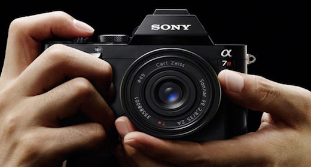

# 一、轮播图实现

  轮播图的应用非常广泛，其实现的原理也比较简单，网络上也有大量关于轮播图实现的方法。这里就具体讲解轮播图的实现方案。

# 二、布局 html

  html部分代码比较简单，其结构主要如下：

```html
<div class="wrap">
	<ul  class="imglist"></ul>
	<ul  class="idotlist"></ul>
	<div class="btns"></div>
</div>
```

  这里贴上html部分的所有代码

```html
<!DOCTYPE html>
<html lang="zh-cn">
<head>
	<meta charset="UTF-8">
	<title>图片轮播 - 横向滚动</title>
	<link rel="stylesheet" type="text/css" href="../css/styles.css">
</head>
<body>
	
<div class="wrap">
	<!-- 图片显示区域 -->
	<ul class="imglist">

		<li></li>

		<li></li>
		<li></li>
		<li></li>
		<li></li>
		<li></li>
		<li></li>

		<li></li>

	</ul>
	<!-- 小圆点区域 -->
	<ul class="idotlist">
		<li idx="1"></li>
		<li idx="2"></li>
		<li idx="3"></li>
		<li idx="4"></li>
		<li idx="5"></li>
		<li idx="6"></li>
	</ul>
	<!-- 左右切换按钮 -->
	<div class="btns">
		<div class="prev"></div>
		<div class="next"></div>
	</div>
</div>

<script type="text/javascript" src="../js/index.js"></script>
</body>
</html>
```

  图片显示区域在第一张图片前加了最后一张图片，在最后一张图片后加了第一张图片，这个是为了后面要实现无限滚动的功能。

# 三、样式 css

    css这一块就不多说了，容器宽高需要固定，并且设置定位方式为 ‘*relative*’，将超出部分隐藏。对于图片显示区域，外层的ul元素的宽度为：*图片宽度\*li标签数*，由于第一个li标签是的图片是最后一张，因此这里需要将外层ul元素向左以图片宽度的位置。每个li使用浮动横向显示。其他布局这里不再累述，直接贴上css代码。

```css
@charset 'utf-8';

body, ul, li, div {margin: 0; padding: 0;}
ul li {list-style: none; float: left;}

.wrap {width: 520px; height: 280px; margin: 100px auto; position: relative; overflow: hidden;}

.imglist {width: calc(8 * 520px); height: 280px; position: relative; left: -520px;}
.imglist li {width: 520px; height: 280px;}

.idotlist {width: 130px; height: 20px; position: absolute; left: calc(50% - 65px); bottom: 10px;}
.idotlist li {width: 9px; height: 9px; border-radius: 50%; background-color: orange; margin-right: 5px; cursor: pointer;}
.idotlist .active {background-color: purple;}

.btn {width: 45px; height: 35px; position: absolute; top: calc(50% - 22.5px); cursor: pointer; display: none;}
.prev {left: 10px; background: url("../images/left.png") no-repeat center;}
.next {right: 10px; background: url("../images/right.png") no-repeat center;}

.wrap:hover .btn {display: block;}
```


# 四、实现 JavaScript

  js中主要处理实现逻辑，下面我会分成几个小知识点来讲解。

## 1、获取元素

```javascript
var oWrap = document.querySelector('.wrap');
var oUl = document.querySelector('.imglist');
var aIdots = document.querySelector('.idotlist').children;
var oPrev = document.querySelector('.prev');
var oNext = document.querySelector('.next');
```

## 2、实现左右切换

  实现左右切换，主要是修改 *oUl.style.left* 的值，其值的变换就是在原来的基础上做一个 `+/-` 图片宽度的操作，这里需要对获取到的*left*值做一个转型parseInt，因为获取到的值带有 *px* 后缀。

```javascript
/**
 * 事件处理
 */
oPrev.onclick = function() {
	tab(-520);
}
oNext.onclick = function() {
	tab(520);
}


/**
 * 函数定义
 */

function tab(offset) {
	var curLeft = getStyle(oUl, 'left');
	oUl.style.left = parseInt(curLeft) + offset + 'px';
}

// 获取非行间样式的值
function getStyle(obj, attr) {
	if (obj.currentStyle) {
		return obj.currentStyle[attr];
	}else {
		return getComputedStyle(obj, false)[attr];
	}
}

```

  上述代码中的*getStyle()*函数主要用于获取非行间样式，*tab()*方法封装的是图片的切换。

## 3、无限滚动

  无限滚动直接根据*left*的值判断做一个归位的操作。比如显示第一张图片的时候如果继续点击则设置left为最后一张的left值，当显示最后一张图片的时候设置left为第一章的left值。这里直接在*tab()*方法中修改即可。

```javascript
function tab(offset) {
	var curLeft = getStyle(oUl, 'left');
	var newLeft = parseInt(curLeft) + offset;
	oUl.style.left = newLeft + 'px';
	
	if (newLeft > -520) {
		oUl.style.left = '-3120px';
	}
	if (newLeft < -3120) {
		oUl.style.left = '-520px';
	}
}
```


## 4、原点与图片同步

  要让原点和图片同步，可以设置*idx*记录图片当前位置的下标，在点击上一张和下一张图片的时候让*idx*自增或自减，但要注意条件判断。然后根据idx取到对应的是哪一个小圆点，将对应原点元素添加*class*属性设置为*active*即可，我们已经设置了“ *.active{}*的样式”。这样会出现一个bug，就是尽管对应原点已经样式已经被修改，但是其他原点依旧保持着这个样式，要解决这个问题，我们可以将非当前图片显示的圆点元素的*class*属性置为空。

```javascript
// 定义下标
var curImgIdx = 1;

oPrev.onclick = function() {
	if (curImgIdx == 1) {
		curImgIdx = 6;
	}else {
		curImgIdx--;
	}
	tab(520);
	changeIdots();
}

// 根据点击更新下标值
oNext.onclick = function() {
	if (curImgIdx == 6) {
		curImgIdx = 1;
	}else {
		curImgIdx++;
	}
	tab(-520);
	changeIdots();
}

// 根据下标志修改原点样式
function changeIdots() {
	for (var i = 0; i < aIdots.length; i++) {
        // 异常处理
		if (aIdots[i].className == 'active') {
			aIdots[i].className = '';
			break;
		}
	}
	aIdots[curImgIdx - 1].className = 'active' ;
}
```


## 5、为小圆点添加事件

  为每一个小圆点添加事件可以通过循环实现，点击小圆点直接调用*tab()*切换图片即可，但是这里我们需要计算出偏移*offset*，而偏移等于目标值-当前值，在控制台我们切换图片可以观察到，其实我们可以根据下标来求得目标值，即*-520\ * (目标图片的下标-当前图片的下标)*，当前图片的下标我们很容易计算，但是要观察到底点击了那一个小圆点，我们可以通过自定义熟悉感*idx*获取，这样就可以算出偏移了。但是这里需要注意一个问题，就是如果点击已经展示的图片的小圆点，我们应该直接不处理。当然，执行完了以后，我们需要更新当前显示图片的下标。代码如下所示：

```javascript
for (var i = 0; i < aIdots.length; i++) {
	aIdots[i].onclick = function() {
		if (this.className == 'active') {
			return;
		}
		var bournIdx = parseInt(this.getAttribute('idx'));
		var offset = -520 * (bournIdx - curImgIdx);
		
		curImgIdx = bournIdx;

		tab(offset);
		changeIdots();
	}
}
```


## 6、动画实现

  

```javascript
function tab(offset) {
	var desLeft = parseInt(getStyle(oUl, 'left')) + offset;

	var time = 500; // 位移总时间
	var interval = 15; // 时间间隔
	var speed = Math.ceil(offset/(time/interval)); // 每次位移移动多少
	var t = setInterval(function() {
		if ((speed < 0 && parseInt(getStyle(oUl, 'left')) > desLeft)||(speed > 0 && parseInt(getStyle(oUl, 'left')) < desLeft)) {
			oUl.style.left = parseInt(getStyle(oUl, 'left')) + speed + 'px';
		}else {

			oUl.style.left = desLeft + 'px';

			if (desLeft > -520) {
				oUl.style.left = '-3120px';
			}

			if (desLeft < -3120) {
				oUl.style.left = '-520px';
			}
			clearInterval(t);
			console.log('清除定时器！');
		}
	}, interval);
}
```

## 7、自动轮播

    自动轮播直接设置定时器调用next点击关联方法即可。但是需要注意当鼠标经过或移开需要重启或清除定时器。


